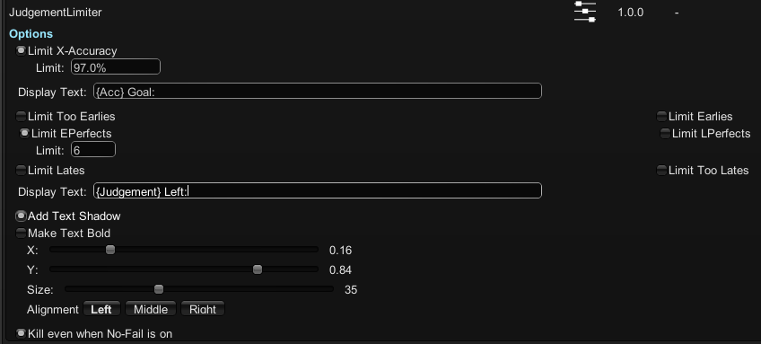

# JudgementLimiter
JudgementLimiter is a mod made for limiting certain judgement as well as set an accuracy goal in the game A Dance Of Fire and Ice.

## Features
* **Limit X-Accuracy** - Assumes final accuracy, if it's lower than the target accuracy, kills the player.
* **Limit Judgements** - Limit the amount of time a certain judgement can be clicked, otherwise, kills the player.

## Note on Display Text

* **{Acc}** - Display the accuracy goal set.
* **{Judgement}** - Display the judgement that's being limited, e.g. {Judgement}(Too Early) Left: